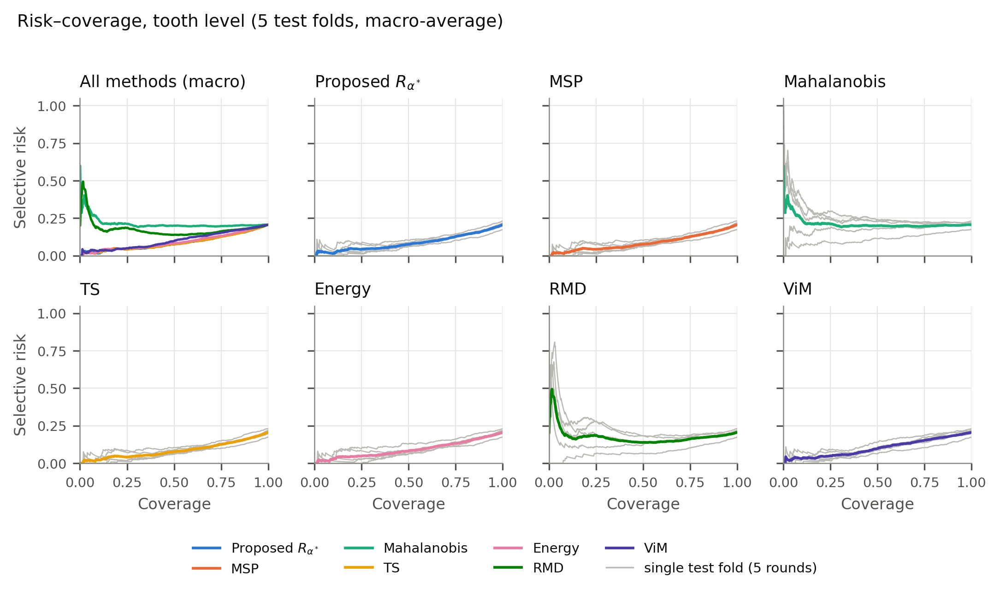
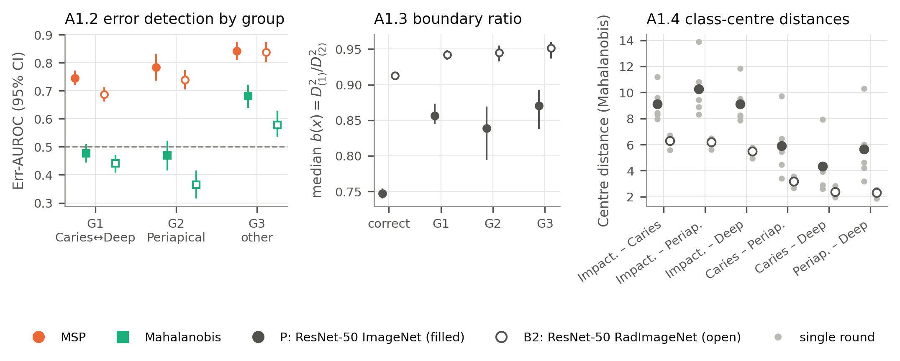
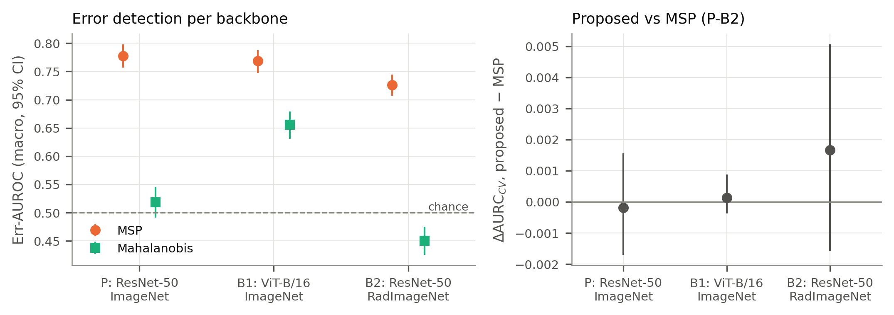

# Which Misclassifications Does Feature-Space Distance Detect?

**An error-type and backbone analysis of selective classification on dental panoramic radiographs**
*(working title)*

DENTEX, `quadrant-enumeration-disease` subset (public training data): 705 panoramic radiographs, 3,523
tooth patches, 4 diagnostic classes. Pre-registered protocol, 5-fold cross-validation, 21 training runs
(11 primary + 10 exploratory).

> **Summary.** In the pre-registered primary comparison, adding a feature-space (Mahalanobis) distance to
> softmax confidence did **not** change selective-classification performance: ΔAURC_CV (gate − MSP) =
> −0.0002 [95% CI −0.0017, +0.0016]. Post hoc (exploratory) analyses then asked *which errors* each
> confidence score detects. Errors concentrate on the Caries ↔ Deep Caries boundary well beyond what independence
> of reference and predicted class would give (59–64% of errors vs 34–35% expected from the confusion-matrix
> margins, on all three backbones). Distance to the nearest
> class centre is at chance level for these boundary errors and for missed periapical lesions on ResNet-50,
> and softmax confidence outranks it in every error-type × backbone cell. With a ViT-B/16 backbone (which also
> brings a different learning rate and pretraining recipe) feature distances are more informative but still
> below softmax; medical-domain pretraining (RadImageNet)
> is associated with a worse confidence ranking, against the prediction written before those runs.

---

## 1. Research idea

A selective classifier may abstain on cases it is unsure about, trading coverage for lower risk. Softmax
confidence (MSP) is the standard confidence score; distance-based scores (Mahalanobis distance to class
centres in feature space) are a common complement, on the intuition that a misclassified case looks atypical
in feature space.

We tested this intuition on four-class differential diagnosis of teeth carrying an expert radiographic
diagnosis annotation (Impacted, Caries, Periapical Lesion, Deep Caries), and then asked why the result came out
as it did:

- **Primary question (confirmatory, pre-registered).** Does gating softmax confidence with a feature-space
  distance improve selective classification over MSP?
- **Q-A (exploratory).** Which kinds of error does each score detect, and why does the distance score miss them?
- **Q-B (exploratory).** Does the answer depend on the backbone family (ResNet-50 vs ViT-B/16, each with its
  own fine-tuning learning rate and pretraining recipe) or on the pretraining domain (natural vs medical images)?

## 2. Data

| | Count |
|---|---|
| Panoramic radiographs | 705 (678 with ≥ 1 annotated tooth; 27 without any annotation) |
| Tooth patches (unit of analysis) | 3,523 (3 box positions with > 1 annotation excluded) |
| Impacted / Caries / Periapical Lesion / Deep Caries | 604 / 2,186 / 157 / 576 |

All constants are counted from the COCO annotations in [`constants.json`](constants.json). Image metadata
contain no patient ID, so folds are split by image. We do not use the official DENTEX challenge split; results
are not comparable with the challenge leaderboard.

## 3. Method

### 3.1 Backbone and features (locked before any run)

- ResNet-50 pretrained on ImageNet, plain cross-entropy; AdamW (lr 1e-4, weight decay 1e-4), cosine schedule,
  batch 64, mixed precision, ≤ 40 epochs, early stopping on validation loss (patience 8).
- Patches: tooth box + 6% margin per side, resized to 224 × 224; augmentation rotation ±10° and colour jitter
  ±10%; CLAHE and horizontal flip off; no test-time augmentation.
- Feature space: penultimate layer → PCA to **d = 64** (fixed a priori) → class centres μ_k and a tied
  Ledoit–Wolf shrunk covariance Σ, all fitted on the training folds only.

### 3.2 Proposed gate

```
S(x)   = MSP (softmax confidence)
g(x)   = − min_k (z − μ_k)ᵀ Σ⁻¹ (z − μ_k)          (distance to the nearest class centre)
Φ_S, Φ_M = ECDF of S and of g on the validation fold of the round
R_α(x) = α·Φ_S(S(x)) + (1 − α)·Φ_M(g(x)),  α ∈ {0, 0.05, …, 1} chosen per fold on validation AURC
```

R_α is monotone in both components. Selected α\* per fold: 0.85, 1.00, 0.85, 0.90, 1.00.

### 3.3 Baselines (same backbone)

MSP, Temperature Scaling, Energy, Mahalanobis, Relative Mahalanobis, ViM. MC-Dropout is excluded (ResNet-50
has no dropout layer; inserting one changes the backbone). Deep Ensembles are reported in a supplementary
table only.

### 3.4 Evaluation protocol

- 5-fold cross-validation stratified by image (`MultilabelStratifiedKFold`, seed 42); each round trains on 3
  folds, calibrates on 1 and predicts on 1, so every patch receives one out-of-fold (OOF) prediction.
- **Primary endpoint AURC_CV:** area under the risk–coverage curve computed **within each fold** (ties handled
  as blocks, integrated over [0, 1]) and macro-averaged over the 5 folds. Raw scores of different folds are
  never ranked together.
- **Confidence intervals:** cluster bootstrap that resamples **radiographs** within each fold (B = 1,000,
  seed 42), paired across methods and backbones. CIs do not include the variability of the parameters fitted
  on validation (α\*, temperature, ECDFs).
- Err-AUROC: AUROC of a score for separating correct from incorrect predictions (0.5 = chance).

### 3.5 Exploratory analyses (post hoc, declared before running)

Declared in plan §17 after the primary result was known. No multiplicity correction and no significance
claims; CIs are descriptive.

- **Part A — error types** (0 extra training): error groups by (reference annotation → prediction):
  **G1** Caries ↔ Deep Caries; **G2** Periapical Lesion → Caries / Deep Caries; **G3** every other error.
  Err-AUROC per group, boundary ratio b(x) = D²(nearest) / D²(second nearest) in the PCA space, centre
  distances, and a crop-size adjustment of g. G1 share compared with its expectation under independence of
  reference and predicted class (confusion-matrix margins, off-diagonal cells).
- **Part B — backbones** (+10 training runs, 5 per backbone): **B1** ViT-B/16 ImageNet changes the
  backbone family: the architecture *together with* its fine-tuning learning rate (1e-5, declared in advance) and its pretraining
  recipe, so these three factors are confounded; **B2** ResNet-50 RadImageNet changes the pretraining domain,
  with the input normalisation of the official RadImageNet PyTorch example ((v − 127.5)·2/255; weights checked
  by sha256 and a full key match). Same folds and evaluation; predictions P-B1…P-B4 written before these runs,
  after the primary result.

## 4. Results

All numbers: OOF prediction set, tooth level, mean [95% bootstrap CI].

### 4.1 Pre-registered primary comparison (ResNet-50)

| Method | AURC_CV ↓ | Err-AUROC ↑ |
|---|---|---|
| MSP | 0.0866 [0.0747, 0.0984] | 0.777 [0.757, 0.798] |
| Temperature Scaling | 0.0864 [0.0747, 0.0983] | 0.778 [0.757, 0.799] |
| Energy | 0.0919 [0.0802, 0.1042] | 0.759 [0.738, 0.780] |
| Mahalanobis | 0.2131 [0.1927, 0.2329] | 0.518 [0.491, 0.546] |
| Relative Mahalanobis | 0.1765 [0.1575, 0.1972] | 0.628 [0.601, 0.653] |
| ViM | 0.1021 [0.0904, 0.1139] | 0.722 [0.700, 0.743] |
| **Proposed gate R_α\*** | **0.0864 [0.0749, 0.0980]** | **0.778 [0.758, 0.799]** |

- ΔAURC_CV gate − MSP = **−0.0002 [−0.0017, +0.0016]** (CI contains 0); gate − ViM = −0.0157 [−0.0209, −0.0099].
- Error rate 20.6% [19.2, 22.1]. Mahalanobis Err-AUROC 0.518 [0.491, 0.546] (chance level); the
  validation-selected α\* was ≥ 0.85 in every fold.

**Selective risk at a validation-calibrated threshold** (ValCalibrated-τ: threshold set on the validation fold
for a target tooth coverage τ; risk and *achieved* coverage on the OOF predictions). Image level: an image is
accepted when all its annotated teeth pass the threshold and counts as an error when ≥ 1 accepted tooth is
wrong (678 images with ≥ 1 annotated tooth; the 27 unannotated images are excluded).

| τ | Tooth risk, MSP | Tooth risk, gate | Tooth coverage MSP / gate | Image risk, MSP | Image risk, gate | Image coverage MSP / gate |
|---|---|---|---|---|---|---|
| 70% | 0.113 [0.099, 0.128] | 0.113 [0.099, 0.129] | 0.700 / 0.700 | 0.246 [0.185, 0.302] | 0.249 [0.190, 0.302] | 0.303 / 0.302 |
| 80% | 0.139 [0.124, 0.153] | 0.139 [0.125, 0.153] | 0.798 / 0.795 | 0.312 [0.258, 0.363] | 0.339 [0.282, 0.392] | 0.421 / 0.427 |
| 90% | 0.167 [0.153, 0.182] | 0.166 [0.152, 0.180] | 0.903 / 0.902 | 0.455 [0.410, 0.502] | 0.452 [0.406, 0.499] | 0.656 / 0.647 |

Accepting 70–90% of teeth accepts only 30–66% of radiographs with no tooth referred, because one uncertain
tooth sends the whole image to review. No paired CI was computed for these threshold differences.



### 4.2 Error types (exploratory)

**Boundary errors are over-represented.** Share of all errors that are Caries ↔ Deep Caries, vs the share
expected if reference and predicted class were independent (same confusion-matrix margins):

| Backbone | Observed G1 share | Expected (independence) | Difference |
|---|---|---|---|
| ResNet-50 ImageNet (P) | 0.593 [0.551, 0.636] | 0.347 [0.318, 0.379] | +0.246 [+0.203, +0.289] |
| ViT-B/16 ImageNet (B1) | 0.643 [0.604, 0.681] | 0.350 [0.320, 0.384] | +0.293 [+0.253, +0.334] |
| ResNet-50 RadImageNet (B2) | 0.621 [0.581, 0.658] | 0.338 [0.306, 0.372] | +0.283 [+0.246, +0.316] |

**Which errors each score detects** — Err-AUROC on {correct} vs {errors of one group}:

| Backbone | Group (n) | MSP | Mahalanobis | MSP − Mahalanobis |
|---|---|---|---|---|
| P | G1 (433) | 0.746 [0.721, 0.773] | 0.477 [0.444, 0.510] | +0.268 [+0.227, +0.314] |
| P | G2 (118) | 0.784 [0.737, 0.830] | 0.469 [0.415, 0.521] | +0.315 [+0.237, +0.396] |
| P | G3 (176) | 0.842 [0.810, 0.874] | 0.681 [0.639, 0.721] | +0.161 [+0.112, +0.214] |
| B1 | G1 (466) | 0.736 [0.712, 0.761] | 0.618 [0.588, 0.647] | +0.118 [+0.090, +0.147] |
| B1 | G2 (125) | 0.803 [0.765, 0.843] | 0.682 [0.641, 0.724] | +0.121 [+0.073, +0.171] |
| B1 | G3 (130) | 0.849 [0.808, 0.887] | 0.779 [0.739, 0.815] | +0.070 [+0.027, +0.116] |
| B2 | G1 (489) | 0.687 [0.662, 0.712] | 0.441 [0.408, 0.470] | +0.246 [+0.201, +0.291] |
| B2 | G2 (150) | 0.740 [0.704, 0.774] | 0.364 [0.316, 0.415] | +0.375 [+0.301, +0.450] |
| B2 | G3 (148) | 0.838 [0.802, 0.874] | 0.578 [0.536, 0.627] | +0.260 [+0.200, +0.317] |

n = errors pooled over the 5 folds (counts only); every AUROC is computed within a fold and macro-averaged.

Further Part A results on ResNet-50:

- Caries – Deep Caries is the closest pair of class centres in 5/5 rounds (Mahalanobis distance 4.32, macro
  over rounds; B1 5/5, B2 2/5).
- No evidence that crop size drives the distance score's failure: Err-AUROC change after size adjustment
  +0.008 [−0.003, +0.020] (B2: 0.000 [−0.003, +0.002]). On B1 the CI excludes 0 (+0.0034 [+0.0004, +0.0065]),
  so size accounts for a small part there.
- Not a matter of the PCA dimension: Mahalanobis Err-AUROC 0.514–0.519 for d ∈ {32, 64, 128, 256}; adding
  Energy as a third component leaves ΔAURC_CV vs MSP at −0.0001 [−0.0017, +0.0017].



### 4.3 Backbones (exploratory)

| | P: ResNet-50 ImageNet | B1: ViT-B/16 ImageNet | B2: ResNet-50 RadImageNet |
|---|---|---|---|
| Error rate | 20.6% [19.2, 22.1] | 20.4% [18.8, 22.1] | 22.4% [20.6, 23.9] |
| AURC_CV, MSP | 0.0866 [0.0747, 0.0984] | 0.0880 [0.0769, 0.0996] | 0.1137 [0.1008, 0.1278] |
| AURC_CV, gate | 0.0864 [0.0749, 0.0980] | 0.0881 [0.0771, 0.0998] | 0.1153 [0.1018, 0.1300] |
| Err-AUROC, MSP | 0.777 [0.757, 0.798] | 0.769 [0.747, 0.788] | 0.726 [0.707, 0.745] |
| Err-AUROC, Mahalanobis | 0.518 [0.491, 0.546] | 0.656 [0.631, 0.679] | 0.450 [0.425, 0.475] |
| ΔAURC_CV gate − MSP | −0.0002 [−0.0017, +0.0016] | +0.0001 [−0.0004, +0.0009] | +0.0017 [−0.0016, +0.0051] |

- **B2 − P (MSP):** ΔAURC_CV +0.0271 [+0.0164, +0.0392], of which +0.0230 [+0.0132, +0.0339] comes from
  ranking quality (E-AURC) and +0.0040 [+0.0010, +0.0074] from the error rate (oracle AURC).
- **B1 − P (MSP):** ΔAURC_CV +0.0014 [−0.0067, +0.0097].
- Predictions written before the Part B runs (after the primary result was known): P-B1 (Mahalanobis below
  MSP), P-B2 (gate ≈ MSP) and P-B4 (G1 > 50% of errors) held on all backbones; P-B3 (backbone differences
  driven by error rate) was not applicable to B1 − P and **failed** for B2 − P.



## 5. Analysis

1. **The pre-registered gate adds nothing measurable over softmax confidence** on this task: the CI of
   ΔAURC_CV contains 0 on all three backbones, and on ResNet-50 the tooth-level selective risks at
   τ = 70/80/90% equal MSP's within 0.001. On
   ResNet-50 the distance component carries no error signal (Err-AUROC at chance).
2. **The dominant failure mode is the adjacent-severity boundary.** Caries ↔ Deep Caries errors exceed their
   independence expectation by 25–29 percentage points on every backbone. Two explanations fit this pattern
   and cannot be separated here: genuine model confusion at the depth boundary, or ambiguity of the reference
   annotation itself (there is no second reader).
3. **Distance to the nearest class centre misses exactly the errors that dominate.** On ResNet-50, boundary
   errors and missed periapical lesions are on average no farther from their nearest class centre than correct
   cases, so the distance score sees them as typical: it is at chance for G1 and G2 and informative only for
   the remaining errors (G3).
4. **Softmax confidence is the better error detector everywhere, but it is weakest on boundary errors**
   (G1 has its lowest Err-AUROC point estimate on every backbone). Improving error detection in this task would therefore
   need to address the severity boundary — a direction suggested by these results, not tested here.
5. **The feature space matters, but not enough to change the conclusion.** With ViT-B/16 (different lr
   and pretraining recipe) the distance score is informative in every error group, yet stays below softmax;
   this cannot be attributed to the architecture alone, because the ViT pretraining recipe (label smoothing,
   mixup, cutmix) itself reshapes feature geometry and softmax calibration. RadImageNet pretraining goes
   with class centres that are closer together relative to the within-class spread (all six pairwise
   Mahalanobis distances smaller; Caries – Deep Caries 2.39 vs 4.32 on ResNet-50 ImageNet, macro over rounds,
   no CI) and with a worse confidence ranking, mostly not through accuracy — contrary to the pre-written
   prediction. A preprocessing error is ruled out (see the verification note in §8).

## 6. Contributions

**Main contribution — an error-type analysis of selective classification in dental differential diagnosis**
(exploratory, post hoc):

- Errors concentrate on the Caries ↔ Deep Caries boundary beyond the independence expectation, consistently
  across three backbones (descriptive finding; label ambiguity is an alternative explanation).
- Feature-space distance is at chance for boundary errors and missed periapical lesions on ResNet-50, and
  softmax confidence outranks it in all nine error-type × backbone cells.

**Secondary contribution — dependence on backbone family and pretraining domain** (exploratory, post hoc):

- With ViT-B/16 (with a different lr and pretraining recipe), feature-space distance is more informative,
  but still below softmax.
- RadImageNet pretraining is associated with a worse confidence ranking (mostly via ranking quality, not
  error rate), against the prediction written before those runs.

## 7. Limitations

- A single publicly released dataset; acquisition provenance not independently verified; no external validation.
- No patient ID in the metadata: folds are split by image, patient-level leakage cannot be checked.
- Training variance is not measured (one training run per fold per backbone).
- All analyses beyond the primary comparison are post hoc; their hypotheses were formed after the primary
  result. B1 confounds architecture, learning rate and pretraining recipe; pretraining recipes also differ
  between ResNet-50 ImageNet and RadImageNet.
- Reference annotations come from DENTEX only; with no second reader, model error and label ambiguity at the
  depth boundary cannot be separated. No labels of radiographic artifacts were collected, so nothing is
  claimed about anatomical or metallic artifacts.
- Per-fold error groups are small (e.g. G2 ≈ 24 errors per fold on ResNet-50), so group-level CIs are wide.
- Augmentation was fixed in advance, not tuned; MC-Dropout is absent (reason in §3.3).
- CIs do not include the variability of parameters fitted on the validation folds.

## 8. Reproducibility

- **Pre-registration:** [`DENTEX_Research_Plan.md`](DENTEX_Research_Plan.md) (v6, locked 2026-09-29). Every
  deviation and implementation detail is logged in **§14 (deviation log)** with its date, before it was applied.
- **Progress log:** [`PROGRESS.md`](PROGRESS.md).
- **Training runs (21):** 5 main CV rounds + 4 Deep Ensembles members + 2 single-round ablations (CLAHE, flip)
  = 11 primary; the Center Loss ablation (§9.4) was dropped for lack of compute (it would have required
  re-running every baseline on that backbone). Part B adds 5 ViT-B/16 + 5 RadImageNet runs.
- **Pipeline:** `00_sanity_checks.py` → `01_extract_patches.py` → `02_dataset_loader.py` → `03_train_backbone.py`
  (Colab T4) → `04_compute_manifold.py` → `05_fit_gate.py` → `06_evaluate.py` → `07_statistics.py` →
  `08_figures.py`; exploratory `09_ablation_d_energy.py`, `10_mechanism.py`, `11_partb_evaluate.py`,
  `12_g1_baseline.py`. Every script has a `--check` self-test.
- **Committed:** fold assignment (`folds.json`, never regenerated), constants, all result files in `outputs/*.json`,
  figures in `figures/paper/`. **Not committed:** DENTEX images and derived patches, model checkpoints,
  bootstrap draws, and the Grad-CAM figure (it shows DENTEX patches).
- **B2 input pipeline verified (2026-10-03):** the RadImageNet weight file matches its pinned sha256 and loads
  with every key matched except the replaced `fc`; its first convolution takes 3 channels, and every patch is a
  224 × 224 image with R = G = B; the eval transform used by the B2 checkpoints (`normalization: radimagenet`,
  recorded in all five checkpoint sidecars and enforced by `04`) equals the official RadImageNet PyTorch example
  (`(v − 127.5)·2/255`, BGR read, no mean/std) on real patches of every class to within 6e-8.
- **Data:** download DENTEX from [Hugging Face](https://huggingface.co/datasets/ibrahimhamamci/DENTEX) and place
  the subset at `DENTEX/training_data/quadrant-enumeration-disease/`. Dataset card: [`DATASET_README.md`](DATASET_README.md).

## Data license and attribution

DENTEX is released under [CC BY-NC-SA 4.0](https://creativecommons.org/licenses/by-nc-sa/4.0/) by Hamamci et al.
The images `figures/data.png`, `figures/output.png` and `figures/dentex.jpg` are reproduced from the DENTEX
dataset card under that license. If you use DENTEX, cite:

- Hamamci, I. E., et al. *DENTEX: An Abnormal Tooth Detection with Dental Enumeration and Diagnosis Benchmark
  for Panoramic X-rays.* arXiv:2305.19112, 2023.
- Hamamci, I. E., et al. *Diffusion-based hierarchical multi-label object detection to analyze panoramic dental
  x-rays.* MICCAI 2023, pp. 389–399.
